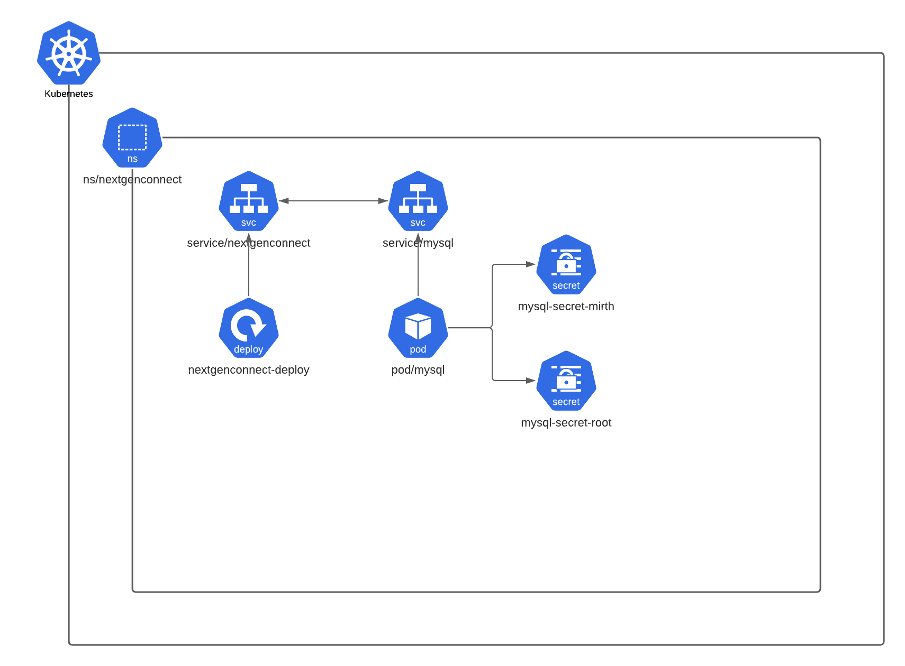

# nextgenconnect



## Prerequistes
1. A working Kubernetes cluster. If you want to follow along with this guide, you should set up [minikube](https://kubernetes.io/docs/getting-started-guides/minikube/) on your machine, as it is the quickest way to get a local Kubernetes cluster setup for experimentation and development.
2. Set up ingress as an add-on. It can be enabled by the following command:

    ```minikube addons enable ingress```

3. The `kubectl` binary should be [installed on your workstation](https://kubernetes.io/docs/getting-started-guides/minikube/#download-kubectl).


## Install
```kubectl apply -f https://github.com/bbraunstein/nextgenconnect/blob/main/k8s/deployment.yaml```


## TODO
* Traefik ingress controller to define rules for routing external traffic to nextgenconnect endpoints.